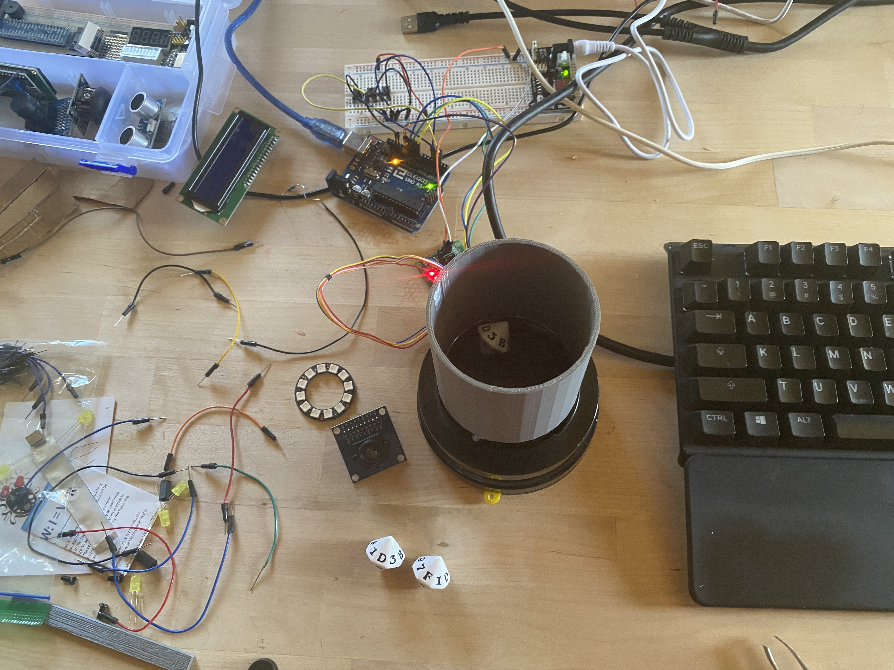

# Random Number Generator Using Real Dice Rolls Recorded by AI

The purpose of this code is to generate real random cryptographic keys. 

This is an AI model that connects a camera to a dice rolling contraption. The contraption rolls the dice every five seconds. The camera snaps a picture and feeds that image into this AI model. The program records the results in a text file so the numbers can be used to generate cryptographic keys. 

